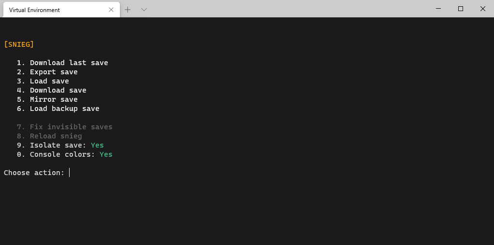
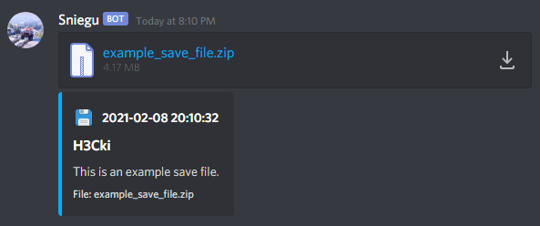

# ❄️ Snieg
Snowrunner save sharing with Discord integration.

## ❔ How does it work?
Map progress in coop is saved only by the host in Snowrunner. This console script allows you to share the progress with other people. 
When you load the external save file, it overwrites your current map progress, level and unlocks, keeping your money and trucks. This solution enables you to have different people hosting the coop game without losing the progress. After loading the save a new save slot will appear in your game.
When you get the hang of it, exporting and loading saves takes less than a minute.

## ❗ Limitations
1. **You have to recover all your vehicles before exporting and loading saves.**
If export the file without retaining your vehicles everyone who loads the save will get access to them on their local save, since ungaraged vehicles are stored in map files, which are fully copied, not merged.
If you load the file without retaining your vehicles you will lose them, since they will be overwritten by the map files that you loaded.
2. Having multiple people play separately using the same save is not supported and will result in branching of your save files. You will effectively have to chose which one to load, since you can't merge.
3. When you load the save file it will appear in the exact position as the external save that you loaded (if you load a save from someone who created their save in slot 2, it will be loaded in slot 2 on your computer too).

## ❗❗ Issues
1. Sometimes you'll have to restart your game because save file will refuse to show up for the first time.
2. Sometimes a save will randomly refuse to show up even after restarting the game twice, the exact cause of this issue is unknown and it can happen only for some people. In this case the only 2 possible solutions are:
    - try option 8 (Reload snieg) and 7 (Fix invisible saves), those have some chance of fixing the issue,
    - load backup save using snieg.
3. Sometimes snieg will not be able to resolve your Snowrunner save directory path and will ask you to paste it in the console. Default path of that directory is: `C:\Users\<user_name>\Documents\My Games\SnowRunner`
4. Some users' snieg can look weird in the console, with a lot of random characters, it is due to coloring not being supported in their cmd. To disable colors press 0 in main menu.
5. Snieg can timeout when you hold it open for some time due to blocking of the async code. In result of that, sending and downloading saves will not be possible, solution -> close and open snieg.
6. It's advised to start a game in the slot that you're about to overwrite for the first time (most likely won't be neccessary).

## 💭 Important
1. If you're using Epic Games Launcher:

When you load the save using snieg it will detect that files have changed. When you run the game it will ask you to `[UPLOAD TO CLOUD]` (keep what you have right now) or `[DOWNLOAD TO MACHINE]` (load files from before you used snieg). Chose first option here.

2. Recover all your vehicles before exporting and loading saves.
3. Keep it organized with your friends, if you play separately some of you can miss progress.

## ⚙️ Discord integration
Snieg can send and download files using Discord webhook and a bot. How to set it up is later described in Setup section.
In short, you create a webhook for your channel of choice and then all save files will be sent to that channel.
[example save]

In order to download files from Discord you have to create an app on Discord's developer portal (also described later).

### 🐍 Requirements
- Python (3.7.9)

### ⚗️ Setup
1. Install requirements
    `python -m pip install  -r requirements.txt`
   
### 🤖 Discord integration setup
1. Create a webhook for the channel.
    - Right click on the text channel
    - Integrations, create new webhook
    - Click copy webhook url.
2. Configure the webhook for snieg.
    - Open your snieg folder and then `data/webhooks.json`
    - Replace <webhook_url> with the url that you just copied.
    - You can alternatively change the name of the webhook, it's avatar url and channel invite url (it shows up in snieg after file has been sent successfully, right click on the channel and create invite link, ideally one that doesnt expire).
3. Create discord app. Go to https://discord.com/developers/applications, create new application. Select it, go to Bot and copy the token.
4. Configure the bot for snieg.
    - Open your snieg folder and then `data/bot.json`
    - Replace <bot_token> with the token you just copied.
    - Make sure you have developer mode enabled on Discord. Go to Settings -> Appearance -> Developer Mode and turn it on.
    - Right-click on the text channel that you selected for snieg webhook and copi it's ID, set "channel_id" in `data/bot.json` to that ID.
    - Invite your bot to your discord.
    - Make sure you haven't permitted your bot from viewing messages in that channel.
    

### 📖 Dictionary
- Save profile - refers to a profile folder in your Snowrunner save directory, where all saves are stored. It is a 32-char long id of your account. Multiple save profiles may appear when you have access to Snowrunner on multiple accounts.
- Local save file - refers to a single save slot in game.

### ⬆️ Exporting the save
1. Open snieg.
2. Chose option `2. Export save`.
3. Follow the instructions.
4. When you get an information "Created export file...", a zipped save file has been created in `export` folder.
5. Send save to Discord.

### ⬇️ Downloading and loading the save
0. Close Snowrunner.
1. Open snieg.
2. Choose option `1. Download last save` if you want do download most recent save on the channel, or `4. Download save` if you want to specifi which one to download.
3. Follow instructions.

### 🚑 Backups
Each time you load a save, old one is backed up. You can restore it by chosing option `6. Load backup save`.

### Creating executable file
In order to create an exe file:
1. Open terminal in snieg directory
2. Run this command: `py -m PyInstaller -c -F -i "icon.ico" snieg.py`
3. After it's done, the executable file will be in "dist" folder. Move it to main directory (next to snieg.py etc)
4. You can now remove following files and folders:
    - __pycache__
    - build
    - dist
    - colors.py
    - snieg.py
    - icon.ico
    - snieg.spec

### + Additional info
Setting isolate saves to True or False will skip the question about removing your previous saves from current save profile (leaving only one save slot with the save that you're about to load).

### 📸 Screenshots

